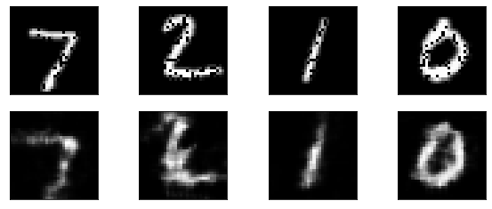
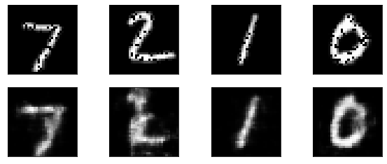

# [PYTORCH] MNIST Denoising and Classification - Multitask Learning

## Introduction

Here is my experiment with multi task learning and how it compares with single task learning. In this project, I created a model with the encoder part following the LeNet architecture. The decoder head is designed by me. In the multitask model, I added a classification head to classify the digits. In the single task model, I only have the denoising head without the classification head.

## Motivation

My goal for this project is to gain experiences with designing and training models in pytorch and to learn about designing multitasking models. In addition, since denoising is a more complicated task than classification, I want to see if LeNet is capable of doing denoising on the MNIST dataset beside classification. Finally, I want to compare the training of single task model and multitask model and see the denoising result of which model is better.

## Datasets:

| Dataset                | Classes |    #Train images      |    #Validation images      |
|------------------------|:-------:|:---------------------:|:--------------------------:|
| MNIST                  |   10    |          60K          |              10k           |

  
- **MNIST**:
  I choose MNIST dataset because I want to see if the LeNet based architecture is able to denoise images since it performs very well on classification. In my code, I download and load the MNIST dataset using torchvision.datasets.MNIST() function.

## Model architecture
In the multitask model, I implemented LeNet in the encoder. I created the decoder by myself. I added a classification head with only fully connected layer. For the denoising only model, I removed the classification head and left only the decoder head.
## Experiments and Results

Here are some hyperparameters I use in all the executions:  
batch_size = 32
num_epochs = 20
learning_rate = 0.001
noise = 0.1

In my first experiment, I built the multitasking model. The result can be seen below. Even though the results are still a bit noisy, I think it is a good result for a simple model like LeNet doing a complex task such as denoising. That means the LeNet based model can do the denoising task and classification task with no problem.

   
  <i>Multitask model results.</i>

In my second experiment, I removed the classification head from the multitask model. This left the model with only the decoder head for the denoising task. The results seem to be a bit less noisy than the multitask model.

   
  <i>Singletask model results.</i>

## Discussion and future works
Both models did well with their tasks. To improve the result of the multitask model, I can try to put weights before the loss of each task and see which combination works better. I can try to make the weight of the denoising task bigger (e.g. 0.8 for denoising and 0.2 for classification) so the model can focus more on the denoising task since the model can already learn the classification task easily.

